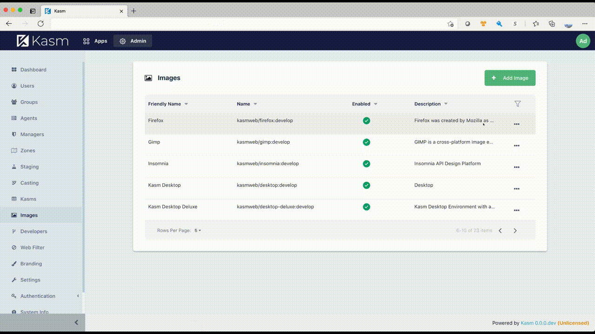

![Screenshot][logo]
# Kasm Workspaces Machine Learning

This project provides a desktop environment geared for machine learning development. It is meant as an example to using DevOps to provide a secure working environment for machine learning using the Kasm Workspaces platform.

Kasm Workspaces is a container streaming platform that provides browser-based access to desktops, applications, and web services. Kasm uses a modern DevSecOps approach for programmatic delivery of services via Containerized Desktop Infrastructure (CDI) technology to create on-demand Docker containers that are accessible via web browser. The rendering of the graphical-based containers is powered by the open-source project  [KasmVNC](https://github.com/kasmtech/KasmVNC)

Kasm Workspaces Community Edition is free for non-commercial use and is limited to 5 concurrent sessions. See the [Kasm Website](https://www.kasmweb.com/index.html?utm_campaign=Github&utm_source=machinelearning) for details on tiers and pricing.


Kasm Workspaces was developed by a team of cybersecurity experts to meet the most demanding secure collaboration requirements.  Our solution makes use of the latest technology in DevOps to establish an architecture that is highly scalable, customizable, and easy to maintain.  Most importantly, Kasm provides a solution, rather than a service, so it is infinitely customizable to your unique requirements and includes a developer API so that it can be integrated with, rather than replace, your existing applications and workflows.

# Install Kasm Workspaces

Get the link to the latest install package from [Kasm Downloads](https://www.kasmweb.com/downloads.html?utm_campaign=Github&utm_source=machinelearning). The following example installs the entire Kasm Workspaces stack on a single system, however, Workspaces can be installed on multiple systems for redundancy and scalability, see the [Documentation](https://www.kasmweb.com/docs/latest/install/multi_server_install.html?utm_campaign=Github&utm_source=machinelearning) for details.

```
wget https://<latest-kasm-version-url>
tar -xzvf kasm*.tar.gz
sudo kasm_release/install.sh
```

When the installation is complete it will output randomly generated credentials, be sure to save them in a safe place. You can login and change the user credentials and/or create new users.

# Workspace Image

This repo contains an example Desktop full of ML tools and development packages. You can use this image directly or create your own version. Ideally, the image would be built on a scheduled pipeline and push updated images to a central Docker registry. Kasm Workspaces will automatically check the registry for updates to the image and pull new layers down as needed. This ensures desktop images are always up to date without users ever experiencing downtime. 

The following command will build the example image. Run this command locally on the system you have installed Kasm Workspaces on.

```
sudo docker build -t kasmweb/desktop-ml:1.9.0 .
```

# GPU Support

Kasm Workspaces (formally Kasm Server) version 1.9.0 and higher supports NVIDIA GPUs. The following requirements must be met.
* NVIDIA GPUs with Architecture >= Kepler (or compute capability 3.0)
* NVIDIA container toolkit must be installed on the host

The agent component will report to the API service the number of GPUs and if the Docker daemon is showing the "nvidia" runtime is available. In the Admin panel the Agents view will list all available compute (Agents) available along with the number of GPUs they are reporting. The following screenshot shows a deployment with two Agents, one with a GPU and one without.


Viewing the details of an Agent, you can see the GPU details on the host. The following example shows the host has a single Tesla T4 GPU.


If an image is configured to require a GPU, it will fail to provision if there is not at least one agent server with the number of GPUs set on the image. 


# Adding a new workspace image

Add a new Workspace image to the deployment and launch. 
1. Clone the Kasm Desktop Image
2. Change the name field to "kasmweb/desktop-ml:1.9.0"
3. Update the Friendly name and description as desired
4. If your system has a GPU, check the require GPU box and set the desired number of GPUs to assign. Set to 0 to assign all available GPUs.
5. Set the desired CPU cores and RAM that shall be assigned to an instance of this image
6. Click Submit to save the changes



# Manual Deployment

While this image is primarily built to run inside the Kasm platform, it can also be executed manually.  Please note that certain functionality, such as audio, is only available within the Kasm platform.

```
sudo docker run --rm  -it --shm-size=512m -p 6901:6901 -e VNC_PW=password kasmweb/desktop-ml:1.9.0
```

The container is now accessible via a browser : `https://<IP>:6901`

 - **User** : `kasm_user`
 - **Password**: `password`

# Help Us Make It Better

Please make a merge request or submit an issue to help us make this a better product for the community. We would greatly appreciate your feedback.

# Tags

  - **[version-number]**
 
    Images are built and tagged along with the release of [**Kasm Workspaces**](https://www.kasmweb.com/index.html?utm_campaign=Github&utm_source=machinelearning) (e.g `1.9.0`). Utilize the version that corresponds to your version of Kasm Server.

  - **[version-number]-rolling**
  
    **Rolling** tags are images that are updated and built nightly (e.g `1.9.0-rolling`). **Kasm Workspaces** administrators may consider using these **rolling** images to ensure their systems are always up to date. 

  - **develop**

     The **develop** tag is meant for testers and provides no expectation of compatibility with current release of **Kasm Workspaces**


# More Info

  - **Platform Documentation**
  
    [**Documentation**](https://kasmweb.com/docs/latest/index.html?utm_campaign=Github&utm_source=machinelearning): Instructions for installing and configuring Kasm Workspaces

 
  - **Reporting Issues**

    [**BitBucket**](https://bitbucket.org/kasmtech/kasm_release/issues/?utm_campaign=Github&utm_source=machinelearning): Report an issue with Kasm Workspaces


  - **Creating Custom Workspaces Images**
  
    [**Documentation**](https://kasmweb.com/docs/latest/how_to/building_images.html?utm_campaign=Github&utm_source=machinelearning): Info on configuring custom images and installing software.
  
    [**BitBucket**](https://bitbucket.org/kasmtech/kasm_release/src/develop/):  Coding examples for creating custom images.
  
  - **KasmVNC**
  
    [**GitHub**](https://github.com/kasmtech/KasmVNC):  Kasm’s Open Source VNC server: browser-based, secure, high-performance.
    

[logo]: https://cdn2.hubspot.net/hubfs/5856039/dockerhub/kasm_logo.png "Kasm Logo"
[Kasm_Dashboard_2]: https://cdn2.hubspot.net/hubfs/5856039/dockerhub/kasm_server_2.png "Kasm Server Dashboard"
[Kasm_Dashboard_3]: https://cdn2.hubspot.net/hubfs/5856039/dockerhub/kasm_server_3.png "Kasm Server Dashboard2"
[Kasm_Kali]: https://cdn2.hubspot.net/hubfs/5856039/dockerhub/kali.png "Kasm Desktop"
[Kasm_Workflow]: https://cdn2.hubspot.net/hubfs/5856039/dockerhub/kasm_workflow_1440.gif "Kasm Workflow"
